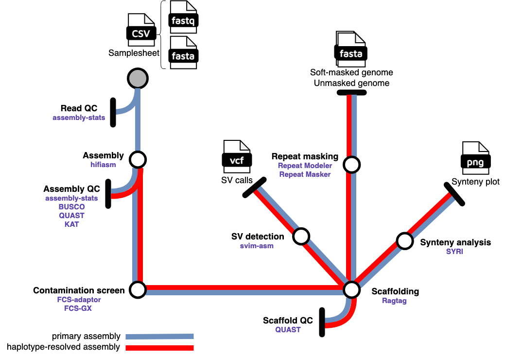

## Introduction

**rl/hifigenomeassembly** is a bioinformatics pipeline that assembles reference-quality genomes from PacBio HiFi reads. Vigorous QCing at both the read and assembly level is done to ensure assembly accuracy and completeness. A reference genome for the same species as the sample being assembled is needed for scaffolding contigs into chromosomes as well as for synteny analysis and the detection of structural variants. Both an unmasked and soft-masked version of the assembled genome are output. Users can specify whether or not to output and QC a primary-only assembly (haploid) or a partially phased assembly (diploid). Currently only haploid or diploid organisms are supported.  



1. Read QC ([`assembly-stats`](https://github.com/sanger-pathogens/assembly-stats))
2. Assembly ([`hifiasm`](https://github.com/chhylp123/hifiasm))
3. Assembly QC ([`assembly-stats`](https://github.com/sanger-pathogens/assembly-stats), [`BUSCO`](https://busco.ezlab.org/), [`QUAST`](https://github.com/ablab/quast), [`KAT`](https://github.com/TGAC/KAT))
4. Contamination detection and removal ([`FCS-adaptor & FCS-GX`](https://github.com/ncbi/fcs?tab=readme-ov-file))
5. Scaffolding ([`ragtag`](https://github.com/malonge/RagTag))
6. Repeat detection (['RepeatModeler'](https://www.repeatmasker.org/RepeatModeler/))
7. Repeat masking (['RepeatMasker`](https://www.repeatmasker.org/RMDownload.html))
8. Synteny analysis ([`SyRI`](https://schneebergerlab.github.io/syri/))
9. Structural variant detection ([`svim-asm`](https://github.com/eldariont/svim))

## Usage

> [!NOTE]
> If you are new to Nextflow and nf-core, please refer to [this page](https://nf-co.re/docs/usage/installation) on how to set-up Nextflow. Make sure to [test your setup](https://nf-co.re/docs/usage/introduction#how-to-run-a-pipeline) with `-profile test` before running the workflow on actual data.

First, prepare a samplesheet with your input data that looks as follows, ensuring that the necessary files are placed in a `data/` folder:

`samplesheet.csv`:

```csv
sample,fastq,fasta
sample1,data/sample1.fastq.gz,data/reference.fasta
```

Each row represents a fastq file (PacBio HiFi) and a genome reference file.

Now, you can run the pipeline using the following command, specifying whether or not you wish to output the primary assembly or a haplotype-resolved assembly using the `--primary-only` flag. Additionally, the `-r` flag needs to be set to the version of the pipeline being used:

```bash
nextflow run rlinder02/rl-hifigenomeassembly \
   -r v1.0.0
   -profile <docker/singularity/.../institute> \
   --input assets/samplesheet.csv \
   --outdir <OUTDIR> \
   --primary_only
```

> [!WARNING]
> Please provide pipeline parameters via the CLI or Nextflow `-params-file` option. Custom config files including those provided by the `-c` Nextflow option can be used to provide any configuration _**except for parameters**_;
> see [docs](https://nf-co.re/usage/configuration#custom-configuration-files).

## Credits

The rl/hifigenomeassembly is a Nextflow DSL2 implementation of a workflow for *de novo* genome assembly described in [this article](https://star-protocols.cell.com/protocols/1799) with modifications made to several modules by Rob Linder.

## Contributions and Support

If you would like to contribute to this pipeline, please see the [contributing guidelines](.github/CONTRIBUTING.md).

## Citations

An extensive list of references for the tools used by the pipeline can be found in the [`CITATIONS.md`](CITATIONS.md) file.

This pipeline uses code developed by the following publication:

>Jun Kim and Chuna Kim. **A beginner’s guide to assembling a draft genome and analyzing structural variants with long-read sequencing technologies**. *STAR Protocols* 2022, DOI: https://doi.org/10.1016/j.xpro.2022.101506.   

This pipeline uses code and infrastructure developed and maintained by the [nf-core](https://nf-co.re) community, reused here under the [MIT license](https://github.com/nf-core/tools/blob/master/LICENSE). 

> **The nf-core framework for community-curated bioinformatics pipelines.**
>
> Philip Ewels, Alexander Peltzer, Sven Fillinger, Harshil Patel, Johannes Alneberg, Andreas Wilm, Maxime Ulysse Garcia, Paolo Di Tommaso & Sven Nahnsen.
>
> _Nat Biotechnol._ 2020 Feb 13. doi: [10.1038/s41587-020-0439-x](https://dx.doi.org/10.1038/s41587-020-0439-x).
